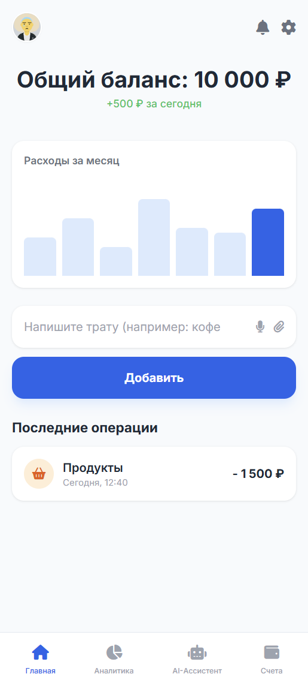
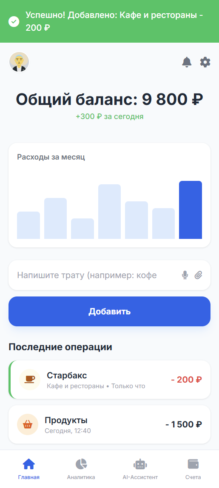
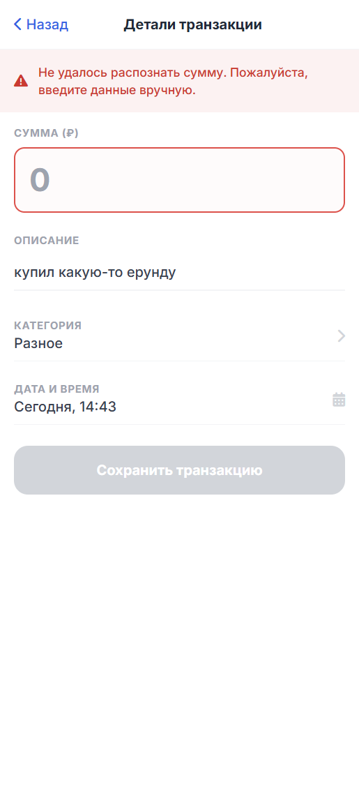
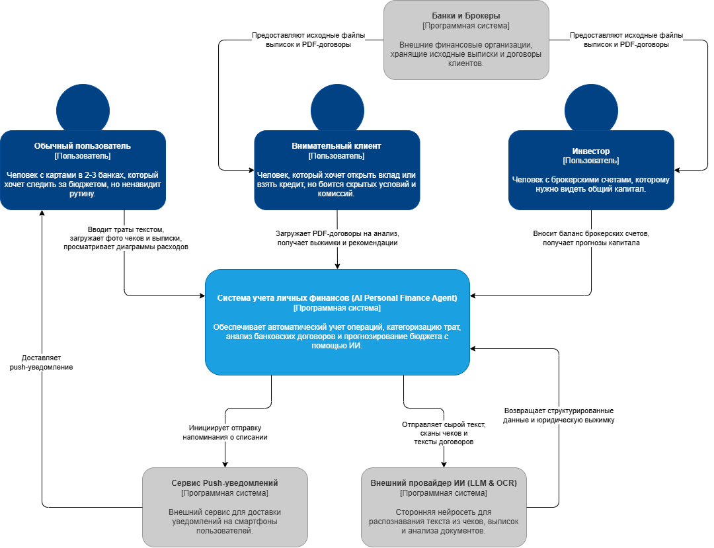
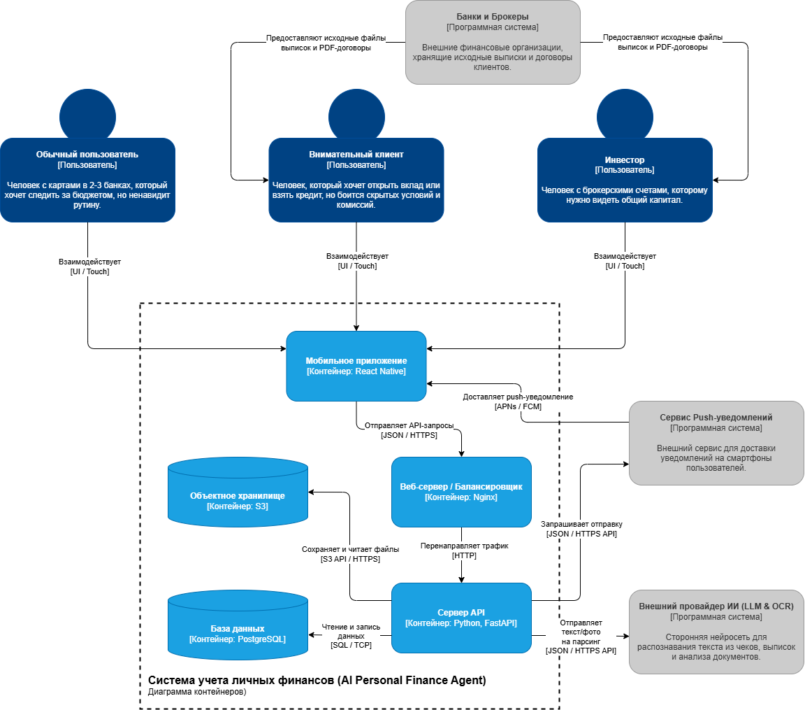

# AI Personal Finance Agent

## Elevator Pitch

* **Проблема:** Учет личных финансов требует муторного ручного ввода каждой операции в приложения-трекеры, а встроенная аналитика банков не видит картину целиком, так как деньги пользователя разбросаны по разным счетам, брокерам, странам и наличным.
* **Решение:** Единое мобильное приложение с встроенным AI-агентом для комплексного автоматического анализа, учета и прогнозирования благосостояния.
* **Киллер-фича:** AI-агент не только автоматически парсит банковские выписки и чеки без ручного ввода, но и умеет анализировать загруженные банковские договоры (вклады, карты, кредиты). Он читает «мелкий шрифт», сравнивает условия и дает независимые рекомендации, в каком банке выгоднее открыть счет.
* **Профит:** Пользователь получает точные графики по своим финансам из всех источников, экономя часы своего времени на рутине, а также избегает скрытых банковских комиссий благодаря ИИ-аналитике договоров.
* **CTA:** Вы готовы посмотреть наш MVP?

## Lean Canvas

| Блок | Описание |
| :--- | :--- |
| **1. Сегменты потребителей** | Физические лица (B2C) со счетами в 2+ банках; инвесторы с брокерскими счетами; люди, желающие вести бюджет, но бросающие из-за рутины. |
| **2. Проблема** | Нет инструмента для автоматического сведения баланса из разных мест; ручной ввод демотивирует; банки не анализируют внешние счета. <br><br>*Существующие альтернативы:* Банковские приложения (ограничены одним банком), классические трекеры расходов (требуют ручного ввода). |
| **3. Уникальная ценность** | Полностью автоматизированный учет личных финансов без ручного ввода благодаря AI, который делает всю работу по распознаванию и категоризации за вас. |
| **4. Решение** | Приложение с AI-помощником, который консолидирует данные из выписок, фотографий чеков и текста, сам обучается запоминать счета и строит прогнозы. |
| **5. Каналы** | Рекламные интеграции в курсах по финансовой грамотности, у финансовых аналитиков и авторов тематических финансовых блогов/каналов (Telegram, YouTube). |
| **6. Потоки прибыли** | Freemium-модель (подписка). Базовая версия бесплатна, но имеет ограничения (по графикам, рекомендациям и количеству токенов/запросов к ИИ). Для новых пользователей предусмотрен бесплатный пробный период (Trial) полной версии. |
| **7. Структура издержек** | Оплата API нейросетей (LLM) за генерацию и анализ; аренда серверов; затраты на маркетинг; разработка и поддержка приложения. |
| **8. Ключевые метрики** | Количество привязанных источников/банков на 1 пользователя; Retention rate (возврат в приложение); конверсия из бесплатного использования (или trial-периода) в платную подписку. |
| **9. Скрытое преимущество** | Наличие специализированной ИИ-модели (или уникальной системы промптов), способной проводить глубокий юридический и финансовый анализ банковских документов. Конкурентам сложно скопировать функционал выявления скрытых комиссий и персональных рекомендаций на основе договоров. |

---

## Роли пользователей

* **Обычный пользователь:** человек с картами в 2-3 банках, который хочет следить за бюджетом, но ненавидит рутину.
* **Внимательный клиент:** человек, который хочет открыть вклад или взять кредит, но боится скрытых условий и комиссий.
* **Инвестор:** человек с брокерскими счетами, которому нужно видеть общий капитал.

## User Stories (Основной путь пользователя)

1. *Как обычный пользователь*, я хочу зарегистрироваться по номеру телефона, чтобы создать свой профиль.
2. *Как обычный пользователь*, я хочу загрузить банковскую выписку (PDF/CSV), чтобы массово добавить историю своих операций.
3. *Как обычный пользователь*, я хочу просто написать текстом «кофе 200р», чтобы ИИ сам создал транзакцию.
4. *Как обычный пользователь*, я хочу сфотографировать бумажный чек, чтобы ИИ распознал товары и добавил их в расходы.
5. *Как обычный пользователь*, я хочу, чтобы ИИ автоматически присваивал категорию (например, «Продукты») моим тратам, чтобы мне не приходилось делать это вручную.
6. *Как обычный пользователь*, я хочу иметь возможность вручную изменить категорию транзакции, если ИИ ошибся.
7. *Как обычный пользователь*, я хочу видеть круговую диаграмму своих расходов за месяц, чтобы понимать, куда уходят деньги.
8. *Как обычный пользователь*, я хочу, чтобы ИИ находил дублирующиеся транзакции и предлагал их удалить.
9. *Как обычный пользователь*, я хочу получать уведомления о предстоящих списаниях за подписки, чтобы вовремя их отменять.
10. *Как внимательный клиент*, я хочу загрузить PDF-файл банковского договора, чтобы ИИ нашел там скрытые комиссии.
11. *Как внимательный клиент*, я хочу получить от ИИ краткую выжимку по договору с рекомендацией (выгодно/невыгодно), чтобы принять решение.
12. *Как инвестор*, я хочу добавить баланс своего брокерского счета, чтобы видеть общий размер капитала.
13. *Как инвестор*, я хочу видеть график прогноза моего капитала на год вперед на основе ИИ-аналитики.
14. *Как обычный пользователь*, я хочу установить лимит трат на категорию «Развлечения», чтобы не выходить за рамки бюджета.

## Приоритезация (Фреймворк MoSCoW)

* **M (Must have — обязаны сделать):** Базовый учет. Истории 1, 2, 3, 5, 6, 7.
* **S (Should have — должны сделать):** Удобство и точность. Истории 4 (сканер чеков), 8 (поиск дубликатов).
* **C (Could have — могли бы сделать для вау-эффекта):** Наша киллер-фича и фишки. Истории 10, 11 (анализ договоров), 9 (подписки).
* **W (Won’t have — пока не будем делать):** Сложные интеграции. Истории 12, 13 (инвесторы и прогнозы), 14 (лимиты).

## MVP и MLP

* **MVP (Минимально жизнеспособный продукт — «скелет»):**
  В MVP войдет только то, без чего приложение не имеет смысла (Must Have). Это: регистрация, загрузка выписок, ввод трат текстом, ИИ-категоризация, возможность ручного редактирования и просмотр базового графика (Истории 1, 2, 3, 5, 6, 7).
* **MLP (Minimum Lovable Product — фичи для удобства и вау-эффекта):**
  Сюда пойдут сканирование чеков (US 4), умный поиск дубликатов (US 8) и ИИ-анализ банковских договоров на скрытые комиссии (US 10, 11). Это то, что заставит пользователей влюбиться в продукт.

## Детализация требований

### История А: ИИ-категоризация трат (US 5)

* **Функциональные требования (FR):**
  * Я могу видеть автоматически присвоенную категорию после загрузки выписки или ввода текста.
  * Я могу выбрать категорию из стандартного списка (Продукты, Транспорт, Развлечения и т.д.), если хочу изменить выбор ИИ.
  * Система должна извлекать сумму, валюту, дату и название магазина из сырого текста операции.
* **Нефункциональные требования (NFR):**
  * Время ответа ИИ на классификацию одной текстовой транзакции не должно превышать 2 секунд.
  * Точность распознавания категорий на тестовой выборке должна быть не ниже 85%.
  * Модель должна поддерживать русский язык и специфичный банковский сленг.

### История B: Загрузка банковской выписки (US 2)

* **Функциональные требования (FR):**
  * Я могу загрузить файл с устройства (телефон/компьютер) с помощью кнопки «Загрузить выписку».
  * Я могу видеть статус-бар (прогресс) обработки документа.
  * Я могу получить уведомление об успешной загрузке с указанием количества добавленных операций.
* **Нефункциональные требования (NFR):**
  * Поддерживаемые форматы файлов строго: PDF, CSV.
  * Максимальный размер загружаемого файла — 15 МБ.
  * Все загруженные файлы должны удаляться с сервера сразу после извлечения данных в базу.

## DDD (Domain-Driven Design)

Архитектура приложения разделена на 4 изолированных доменных зоны (контекста)

### Домен «Пользователи и Доступ» (Identity & Access)

* **Описание**: Зона отвечает за регистрацию, авторизацию, управление профилем пользователя и уровни доступа (настройки подписки для Freemium-модели).
* **Глоссарий**: Пользователь (User), Учетная запись (Account), Авторизация (Auth), Подписка (Subscription).

### Домен «Транзакции и Учет» (Transactions & Accounting)

* **Описание**: Ядро приложения. Здесь хранится история расходов и доходов, ведется привязка транзакций к источникам (банки, брокеры, наличные) и осуществляется ручное редактирование.
* **Глоссарий**: Транзакция (Transaction), Банковский счет (Bank Account), Выписка (Statement), Категория (Category), Баланс (Balance).

### Домен «ИИ и Парсинг» (AI Processing)

* **Описание**: Интеллектуальная зона, где сырые данные (введенный текст, PDF-договоры, фотографии чеков) анализируются нейросетями и превращаются в структурированную информацию с рекомендациями.
* **Глоссарий**: Сырой ввод (Raw Input), Распознавание (Parsing), Промпт (Prompt), Уверенность ИИ (Confidence).

### Домен «Аналитика» (Analytics & Reports)

* **Описание**: Модуль для генерации визуальных отчетов, подсчета статистики за выбранные периоды и прогнозирования бюджета.
* **Глоссарий**: Отчет (Report), Диаграмма (Chart), Лимит бюджета (Budget Limit), Прогноз (Forecast).

## BDD (Behavior-Driven Development)

**Критический путь:** Пользователь добавляет новую транзакцию с помощью текстового ввода, а ИИ-агент ее распознает, категоризирует и обновляет баланс.

### Сценарий 1: Успешное распознавание траты (Сценарий успеха)

* **Дано (Given):** Пользователь авторизован и находится на главном экране приложения.
* **И:** Текущий общий баланс пользователя составляет 10 000 рублей.
* **Когда (When):** Пользователь вводит в текстовое поле строку «кофе 200р в старбаксе» и нажимает кнопку «Добавить».
* **Тогда (Then):** Система (ИИ) успешно распознает сумму (200), валюту (RUB) и автоматически присваивает транзакции категорию «Кафе и рестораны».
* **И:** В списке последних операций появляется новая запись на 200 рублей.
* **И:** Общий баланс пользователя пересчитывается и составляет 9 800 рублей.

### Сценарий 2: Ошибка распознавания из-за неполных данных (Сценарий отказа)

* **Дано (Given):** Пользователь авторизован и находится на главном экране приложения.
* **Когда (When):** Пользователь вводит в текстовое поле невнятную строку «купил какую-то ерунду» (без указания точной суммы) и нажимает кнопку «Добавить».
* **Тогда (Then):** Система (ИИ) не может извлечь обязательный параметр (сумма транзакции).
* **И:** Новая транзакция не создается.
* **И:** Пользователю показывается сообщение об ошибке: «Не удалось распознать сумму. Пожалуйста, скорректируйте текст или заполните данные вручную» (открывается форма ручного ввода согласно US 6).

## Wireframes (Наброски экранов)

### Экран 1: Главный экран / Dashboard (Начальное состояние)



### Экран 2: Главный экран (Сценарий Успеха - После ввода текста)



### Экран 3: Форма ручного редактирования (Сценарий Отказа)



## API-First (JSON-контракты)

В соответствии с подходом API-First, контракты спроектированы до начала разработки бэкенда. Это позволяет фронтенд-команде сразу начать работу на моках (заглушках), не дожидаясь готовности серверной части. Ниже представлены две главные ручки (endpoints) для нашего MVP.

### Ручка 1: Распознавание траты через ИИ-агента

**Endpoint:** `POST /api/v1/transactions/parse`

**Описание:** Отправляет сырой текст пользователя ИИ-агенту для извлечения данных о транзакции (используется на главном экране).

**Request (Запрос от мобилки к бэкенду):**

```json
{
  "user_id": "550e8400-e29b-41d4-a716-446655440000",
  "raw_text": "кофе 200р в старбаксе",
  "source": "text_input"
}
```

**Response (Ответ бэкенда при успешном разборе - 200 OK):**

```json
{
  "status": "success",
  "data": {
    "amount": 200.00,
    "currency": "RUB",
    "category_id": "cat_cafe",
    "category_name": "Кафе и рестораны",
    "merchant_name": "Старбакс",
    "date": "2026-05-04T08:30:00Z",
    "ai_confidence_score": 0.95
  }
}
```

### Ручка 2: Сохранение транзакции

**Endpoint:** `POST /api/v1/transactions`

**Описание:** Сохраняет финальную транзакцию в базу данных пользователя. Вызывается после подтверждения автоматического парсинга, либо при нажатии кнопки "Сохранить транзакцию" на экране ручного ввода (Сценарий отказа).

**Request (Запрос от мобилки к бэкенду):**

```json
{
  "user_id": "550e8400-e29b-41d4-a716-446655440000",
  "amount": 200.00,
  "currency": "RUB",
  "category_id": "cat_cafe",
  "description": "кофе 200р в старбаксе",
  "transaction_date": "2026-05-04T08:30:00Z",
  "account_id": "acc_main_123"
}
```

**Response (Ответ бэкенда - 201 Created):**

```json
{
  "status": "success",
  "data": {
    "transaction_id": "txn_987654321",
    "created_at": "2026-05-04T08:30:05Z",
    "new_balance": 9800.00
  }
}
```

## Схема C4

### Уровень 1. Контекст Системы



### Уровень 2. Контейнеры


